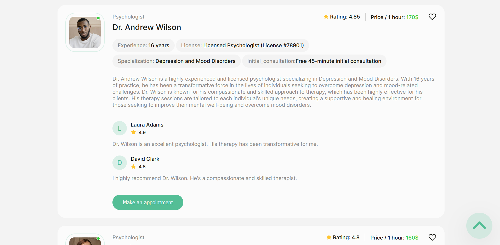

# Psychologists.Services

Psychologists.Services is a web application that allows users to browse a list of psychologists, read information about them, and make appointments. Users can register, log in, manage their favorite psychologists and make an appointment.


## Features

- User Authentication: Register and log in to the application.
- Home Page: Includes buttons for registration and login, which open modal forms for user authentication.
- Psychologists List: Browse through a list of psychologists, view their details, prices, experience, and reviews.
  

- Favorites: Logged-in users can add psychologists to their favorites and view them on a private route.
- Make an Appointment: Book an appointment with a psychologist through a modal form.
  

- Favorites Management: Add or remove psychologists from favorites using a heart icon on each psychologist's card.
- Filtering: Filter psychologists and favorites by price, name, and popularity.

- Responsive Design: The layout is responsive and works on devices from 320px to 1440px.

## Tech Stack

**Frontend:** React, Redux, React Router, Emotion

**Backend:** Firebase (for user authentication and real-time database)

**Form Handling:** React Hook Form, Yup

**UI Components:** React Loader Spinner, React Scroll to Top, SweetAlert2

**State Persistence:** Redux Persist

**Responsive Design:** CSS Flexbox and Grid for responsive layouts

## Routes

- `/` - Home Page:
  - Description: Landing page with buttons for registration and login.
  - Components: Registration and login modals.


- `/psychologists` - Psychologists Page:
  - Description: View a list of psychologists with their details.
  - Components: Psychologist cards with details, filter options, and appointment booking modal.


- `/favorites` - Favorites Page:

  - Description: Private route for logged-in users to view their favorite psychologists.
  - Components: Favorite psychologist cards with details and filter options.

  

## Design and Technical Documentation

- Design Mockups: [View Design Mockups](https://www.figma.com/file/I5vjNb0NsJOpQRnRpMloSY/Psychologists.Services?type=design&node-id=0-1&mode=design&t=4zfT2zFANRbp1fCK-0)
- Technical Requirements: [View Technical Requirements](https://docs.google.com/document/d/1PrTxBn6HQbb0Oz17g5_zvyLGIOZg0TIP3HPaEEp6ZLs/edit)

## Installation

To run this project locally, follow these steps:

1. Clone the repository:

```bash
  git clone https://github.com/ValentinaHotsa/psychologists
```

2. Install the dependencies:

```
npm install
```

3. Start the development server:

```
npm start
```

## Author

For more information or if you have any questions, feel free to contact me:

- GitHub [ValentinaHotsa](https://github.com/ValentinaHotsa)
- LinkedIn [Valentyna Hotsa](https://www.linkedin.com/in/valentynahotsa/)

# UA

Psychologists.Services — це веб-додаток, який дозволяє користувачам переглядати список психологів, читати інформацію про них і записуватися на прийом. Користувачі можуть зареєструватися, увійти, керувати обраними та записатись до психолога.


## Особливості

- Автентифікація користувача: зареєструйтеся та увійдіть у програму.
- Домашня сторінка: містить кнопки для реєстрації та входу, які відкривають модальні вікна з формами для автентифікації користувача.
- Список психологів: перегляньте список психологів, подивіться інформацію про них, ціни, досвід та відгуки.
  

- Вибране: зареєстровані користувачі можуть додавати психологів у свої вибрані та переглядати їх на приватному роуті.
- Записатися на прийом: записатися на прийом до психолога через форму.
  

- Керування вибраним: додавайте або видаляйте психологів із обраного за допомогою значка серця на картці кожного психолога.
- Фільтрація: фільтруйте психологів і обране за ціною, назвою та популярністю.
- Адаптивний дизайн: макет адаптивний і працює на пристроях від 320px до 1440px.

## Маршрути

- `/` - Домашня сторінка:
- Опис: головна сторінка з кнопками для реєстрації та входу.
- Компоненти: модальні вікна реєстрації та входу.


- `/psychologists` - Сторінка психологів:
- Опис: перегляд списку психологів із їхніми даними.
- Компоненти: картки психологів з деталями, параметрами фільтрів і записом на прийом.


- `/favorites` - Сторінка вибраного:
- Опис: приватний маршрут для зареєстрованих користувачів для перегляду своїх обраних психологів.
- Компоненти: картки обраних психологів з деталями та параметрами фільтрів.

  

## Дизайн-макет та технічне завдання

- Макет: [Переглянути макет](https://www.figma.com/file/I5vjNb0NsJOpQRnRpMloSY/Psychologists.Services?type=design&node-id=0-1&mode=design&t=4zfT2zFANRbp1fCK-0)
- Технічне завдання: [Переглянути технічне завдання](https://docs.google.com/document/d/1PrTxBn6HQbb0Oz17g5_zvyLGIOZg0TIP3HPaEEp6ZLs/edit)

## Встановлення

Щоб запустити цей проект локально, виконайте такі дії:

1. Клонуйте репозиторій:

```bash
  git clone https://github.com/ValentinaHotsa/psychologists
```

2. Встановіть залежності:

```
npm install
```

3. Запустіть сервер розробки:

```
npm start
```

## Автор

Щоб отримати додаткову інформацію або у вас виникли запитання, зв'яжіться зі мною:

- GitHub [ValentinaHotsa](https://github.com/ValentinaHotsa)
- LinkedIn [Valentyna Hotsa](https://www.linkedin.com/in/valentynahotsa/)
